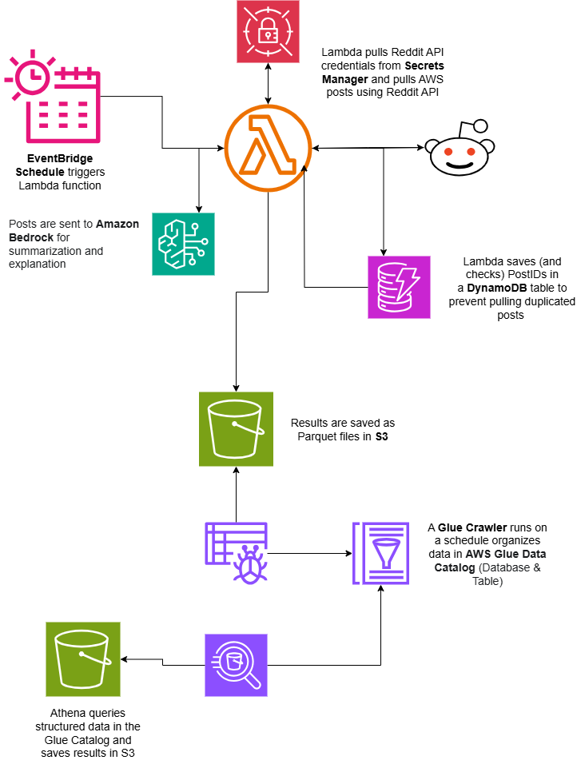

# AWS Serverless Reddit Data Analysis Pipeline

This project implements a serverless data pipeline on AWS to pull posts from the r/aws subreddit, summarize them using Amazon Bedrock (Anthropic Claude 3), and store the data for analysis using AWS Glue and Amazon Athena. It serves as a portfolio project to demonstrate real-world AWS service integration and data engineering practices, all provisioned using Terraform.

## Project Goal

The primary goal is to collect and analyze discussions from the r/aws subreddit to identify real-world problems, solutions, and trends discussed by the AWS community. This data can then be studied to enhance understanding of common AWS challenges and use cases.

## Architecture Overview

The pipeline follows a serverless, event-driven architecture:

1.  **Data Ingestion (Scheduled):**
    *   An **Amazon EventBridge (CloudWatch Events) Schedule** triggers an AWS Lambda function on a regular basis (e.g., daily or weekly).

2.  **Data Processing & Enrichment (AWS Lambda):**
    *   The **AWS Lambda** function is written in Python and performs the following:
        *   Retrieves Reddit API credentials securely from **AWS Secrets Manager**.
        *   Queries an **Amazon DynamoDB** table to check for already processed post IDs, preventing duplicate ingestion.
        *   Pulls the latest posts (e.g., last 5 new posts) and their comments from the specified Reddit subreddit (r/aws) using the Reddit API (PRAW library).
        *   For each new post, it sends the content (e.g., post body or a combination of title and body) to **Amazon Bedrock**, invoking a foundation model (e.g., Anthropic Claude 3 Haiku) to generate a concise summary.
        *   Saves the original post data along with its generated summary as a Parquet file in an **Amazon S3** bucket. Data in S3 is partitioned (e.g., by year, month, day) to optimize downstream querying.
        *   Stores the ID of the processed post in the **Amazon DynamoDB** table to mark it as processed.

3.  **Data Cataloging (AWS Glue):**
    *   An **AWS Glue Crawler** is scheduled to run periodically (e.g., daily or weekly, after data ingestion).
    *   The crawler scans the Parquet files in the S3 bucket.
    *   It infers the schema and partition structure, then creates or updates a table definition in the **AWS Glue Data Catalog**. This catalog acts as a central metastore for your data.

4.  **Data Querying & Analysis (Amazon Athena):**
    *   **Amazon Athena** is used to run standard SQL queries directly on the data stored in S3.
    *   Athena uses the table definitions in the AWS Glue Data Catalog to understand the data's schema and location.
    *   Query results from Athena are stored in a separate S3 bucket.
    *   This allows for ad-hoc analysis, data exploration, and can be a source for BI tools like Amazon QuickSight.

### Architecture Diagram




## AWS Services Used

*   **AWS Lambda:** Serverless compute for data ingestion and processing.
*   **Amazon EventBridge (CloudWatch Events):** Schedules Lambda function invocations.
*   **Amazon S3:** Scalable storage for raw and processed data (Parquet files) and Athena query results.
*   **Amazon DynamoDB:** NoSQL database for tracking processed Reddit post IDs.
*   **AWS Secrets Manager:** Securely stores Reddit API credentials.
*   **Amazon Bedrock:** Provides access to foundation models (Anthropic Claude 3) for text summarization.
*   **AWS Glue:**
    *   **Glue Data Catalog:** Metastore for data schemas and partitions.
    *   **Glue Crawler:** Discovers and catalogs data from S3.
*   **Amazon Athena:** Serverless interactive query service for analyzing data in S3 using SQL.
*   **AWS IAM:** Manages permissions and access for all services.
*   **Terraform:** Infrastructure as Code (IaC) tool used to provision and manage all AWS resources.

## Prerequisites

Before deploying this project, ensure you have the following:

1.  **AWS Account:** An active AWS account.
2.  **AWS CLI:** Configured with credentials that have permissions to create the necessary resources.
3.  **Terraform:** Installed locally (see [Terraform Installation Guide](https://learn.hashicorp.com/tutorials/terraform/install-cli)).
4.  **Reddit API Credentials:**
    *   You need to register an application on Reddit to get a **Client ID** and **Client Secret**.
    *   Go to [Reddit Apps](https://www.reddit.com/prefs/apps).
    *   Click "are you a developer? create an app...".
    *   Choose a name, select "script" as the type, and provide a redirect URI (e.g., `http://localhost:8080` - it won't actually be used for a script app).
    *   Once created, you will see your `client_id` (under the app name) and `client_secret`.
5.  **Store Reddit Credentials in AWS Secrets Manager:**
    *   Create a new secret in AWS Secrets Manager.
    *   Choose "Other type of secret".
    *   Store the secret as key/value pairs. For example:
        ```json
        {
          "REDDIT_CLIENT_ID": "YOUR_REDDIT_CLIENT_ID",
          "REDDIT_CLIENT_SECRET": "YOUR_REDDIT_CLIENT_SECRET",
          "REDDIT_USER_AGENT": "AWSAnalysisBot/0.1 by YourUsername" 
        }
        ```
    *   Note down the **ARN** of this secret.

## Project Structure

.
├── lambda_code/ # Python source code for the AWS Lambda function
│ └── redditAwsPostAnalyzer.py
├── lambda_layer/ # Dependencies for the Lambda function (packaged as a layer)
│ └── python/ # Standard directory structure for Python layers
│ └── <package_files>...
├── main.tf # Main Terraform configuration file
├── variables.tf # Terraform variable definitions
├── outputs.tf # Terraform output definitions
├── providers.tf # Terraform provider configurations
├── .gitignore # Specifies intentionally untracked files that Git should ignore
└── README.md # This file


## Deployment Instructions

1.  **Clone the Repository:**
    ```bash
    git clone <repository-url>
    cd <repository-name>
    ```

2.  **Prepare Lambda Layer Dependencies (if not already packaged):**
    Ensure the `lambda_layer/python/` directory contains all necessary Python packages. If you have a `requirements.txt` for the layer:
    ```bash
    # Example:
    # mkdir -p lambda_layer/python
    # pip install -r lambda_layer/requirements.txt -t ./lambda_layer/python/
    ```

3.  **Configure Terraform Variables:**
    Create a file named `terraform.tfvars` in the root of the project directory. This file will contain values for variables that need to be set for your specific deployment. **This file should NOT be committed to Git if it contains sensitive information (it's usually covered by `.gitignore`).**

    ```terraform
    // terraform.tfvars

    // REQUIRED: Provide your globally unique S3 bucket name for storing ingested data
    s3_bucket_name = "your-unique-bucket-name-for-reddit-data"

    // REQUIRED: Provide the ARN of the AWS Secrets Manager secret containing your Reddit API credentials
    secrets_manager_secret_arn = "arn:aws:secretsmanager:YOUR_REGION:YOUR_ACCOUNT_ID:secret:YOUR_SECRET_NAME-XXXXXX"

    // Optional: Override the default AWS region if needed
    // aws_region = "us-east-1"

    // Optional: Override other variables defined in variables.tf as needed
    // project_name = "my-custom-reddit-analyzer"
    ```

4.  **Initialize Terraform:**
    This command downloads the necessary provider plugins.
    ```bash
    terraform init
    ```

5.  **Plan the Deployment:**
    This command shows you what resources Terraform will create, modify, or destroy.
    ```bash
    terraform plan
    ```
    Review the plan carefully.

6.  **Apply the Configuration:**
    This command provisions the infrastructure on AWS.
    ```bash
    terraform apply
    ```
    Type `yes` when prompted to confirm.

## Post-Deployment

*   The EventBridge schedule will start triggering the Lambda function as per its cron expression.
*   The Glue Crawler will run on its schedule to catalog new data.
*   After the first few successful Lambda runs and a Glue Crawler run, you can start querying your data in Amazon Athena using the `reddit-aws-analyzer_reddit_data_db` database and the `reddit_analysis` table (or similar, based on actual names).

## Querying Data with Athena

1.  Go to the Amazon Athena console in your AWS account and selected region.
2.  Ensure your **Workgroup** is set to `reddit-aws-analyzer-workgroup` (or the name derived from your `project_name`).
3.  Select the **Database**: `reddit-aws-analyzer_reddit_data_db`.
4.  You can now query the `reddit_analysis` table.

    **Example Queries:**
    *   Get the 10 most recent posts (assuming a timestamp column):
        ```sql
        -- Assuming you have a 'submission_timestamp' column
        -- SELECT * FROM "reddit_analysis"
        -- ORDER BY submission_timestamp DESC
        -- LIMIT 10;
        ```
    *   Find posts summarized with a specific category (assuming 'suggestedcategories' is an array):
        ```sql
        -- SELECT *
        -- FROM "reddit_analysis"
        -- WHERE CONTAINS(suggestedcategories, 'Databases');
        ```

## Cleaning Up

To remove all resources created by this Terraform configuration:
```bash
terraform destroy
```

